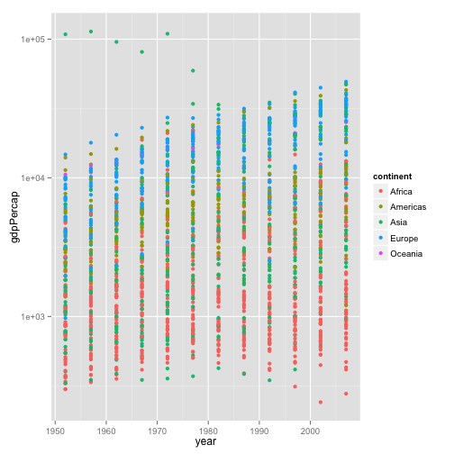
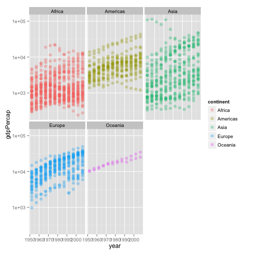
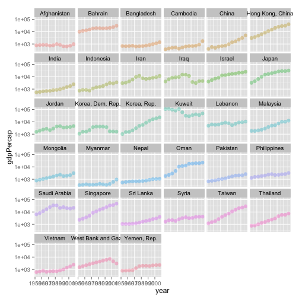
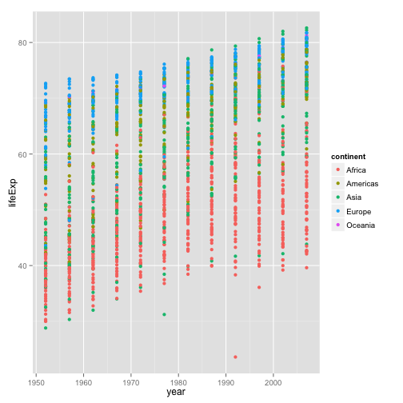
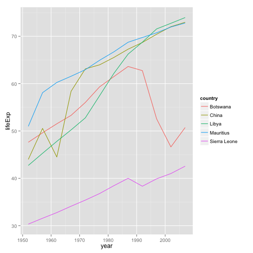
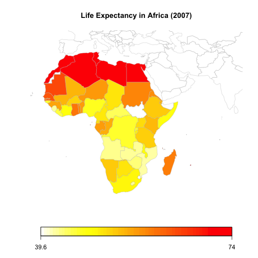

HW2: Exploring Gapminder
===============================
## Michelle Lee
### Sept 22, 2014


### Loading the dataset
 
**Load the Gapminder data with read.delim() and read.table() without specifying args other than `file`. Do you get the same resulting object in your workspace?**


I loaded the data -but got an error message when I try to use `read.table()`.

```r
gDelim <- read.delim("gapminderDataFiveYear.txt")
gTable <- read.table("gapminderDataFiveYear.txt")
```

```
## Error: line 146 did not have 6 elements
```

**If you're not getting the same object, why not?**

This is the minimum amount of code needed for `read.table()` to work. 


```r
gTable <- read.table("gapminderDataFiveYear.txt", fill = TRUE)
```

Documentation for `read.table()` says: "If TRUE then in case the rows have unequal length, blank fields are implicitly added." The warning from R Console indicated that line 146 did not have 6 elements. I checked line 147, and sure enough - Bosnia and Herzegovina overlapped onto the 2nd and 3rd columns.


```r
gTable[c(143:147),]
```

```
##          V1          V2          V3       V4      V5          V6
## 143 Bolivia        1997     7693188 Americas   62.05 3326.143191
## 144 Bolivia        2002     8445134 Americas  63.883  3413.26269
## 145 Bolivia        2007     9119152 Americas  65.554 3822.137084
## 146  Bosnia         and Herzegovina     1952 2791000      Europe
## 147   53.82 973.5331948
```

**Develop the call to `read.table()` that is equivalent to `read.delim().`**

I tried again by adding more detail - but it wasn't enough to make it equivalent. 

```r
gTable <- read.table("gapminderDataFiveYear.txt", header = TRUE, sep = "\t", fill = TRUE)
identical(gTable, gDelim)
```

```
## [1] FALSE
```
Why not? On closer examination, I saw that the number of observations aren't the same:


```r
str(gTable); str(gDelim)
```

```
## 'data.frame':	1698 obs. of  6 variables:
##  $ country  : Factor w/ 147 levels "Afghanistan",..: 1 1 1 1 1 1 1 1 1 1 ...
##  $ year     : int  1952 1957 1962 1967 1972 1977 1982 1987 1992 1997 ...
##  $ pop      : num  8425333 9240934 10267083 11537966 13079460 ...
##  $ continent: Factor w/ 5 levels "Africa","Americas",..: 3 3 3 3 3 3 3 3 3 3 ...
##  $ lifeExp  : num  28.8 30.3 32 34 36.1 ...
##  $ gdpPercap: num  779 821 853 836 740 ...
```

```
## 'data.frame':	1704 obs. of  6 variables:
##  $ country  : Factor w/ 142 levels "Afghanistan",..: 1 1 1 1 1 1 1 1 1 1 ...
##  $ year     : int  1952 1957 1962 1967 1972 1977 1982 1987 1992 1997 ...
##  $ pop      : num  8425333 9240934 10267083 11537966 13079460 ...
##  $ continent: Factor w/ 5 levels "Africa","Americas",..: 3 3 3 3 3 3 3 3 3 3 ...
##  $ lifeExp  : num  28.8 30.3 32 34 36.1 ...
##  $ gdpPercap: num  779 821 853 836 740 ...
```

Being somewhat of an R beginner, I looked it up on Stack Overflow on [how to compare two dataframes easily.](http://stackoverflow.com/questions/7494848/standard-way-to-remove-multiple-elements-from-a-dataframe) Only Cote d'Ivoire seems to have a problem, most likely because of the apostrophe in its name.


```r
`%notin%` <- function(x,y) !(x %in% y) 
gDelim[(gDelim$country %notin% gTable$country),]
```

```
##           country year      pop continent lifeExp gdpPercap
## 361 Cote d'Ivoire 1952  2977019    Africa   40.48      1389
## 362 Cote d'Ivoire 1957  3300000    Africa   42.47      1501
## 363 Cote d'Ivoire 1962  3832408    Africa   44.93      1729
## 364 Cote d'Ivoire 1967  4744870    Africa   47.35      2052
## 365 Cote d'Ivoire 1972  6071696    Africa   49.80      2378
## 366 Cote d'Ivoire 1977  7459574    Africa   52.37      2518
## 367 Cote d'Ivoire 1982  9025951    Africa   53.98      2603
## 368 Cote d'Ivoire 1987 10761098    Africa   54.66      2157
## 369 Cote d'Ivoire 1992 12772596    Africa   52.04      1648
## 370 Cote d'Ivoire 1997 14625967    Africa   47.99      1786
## 371 Cote d'Ivoire 2002 16252726    Africa   46.83      1649
## 372 Cote d'Ivoire 2007 18013409    Africa   48.33      1545
```
I modified the `read.table()` command to include this.

How about now?

```r
gTable2 <- read.table("gapminderDataFiveYear.txt", header = TRUE, sep = "\t", quote = "\"", fill = TRUE)
identical(gTable2, gDelim)
```

```
## [1] TRUE
```

Yay!
To summarize: I found two major differences between `read.table` and `read.delim`: the quote and fill.


### Smell testing the data

**Is it a data.frame, matrix, vector, list? What's it's mode, class? How many variables? How many rows/observations? What flavour is each variable?**

`str` tells me that it is a data frame, with 1704 observations of 6 variables, and the flavour of each variable - country and continent as factors, year as integer, and popuplation, life expectancy, and GDP per captia as numbers. 

```r
gDat=gDelim
str(gDat)
```

```
## 'data.frame':	1704 obs. of  6 variables:
##  $ country  : Factor w/ 142 levels "Afghanistan",..: 1 1 1 1 1 1 1 1 1 1 ...
##  $ year     : int  1952 1957 1962 1967 1972 1977 1982 1987 1992 1997 ...
##  $ pop      : num  8425333 9240934 10267083 11537966 13079460 ...
##  $ continent: Factor w/ 5 levels "Africa","Americas",..: 3 3 3 3 3 3 3 3 3 3 ...
##  $ lifeExp  : num  28.8 30.3 32 34 36.1 ...
##  $ gdpPercap: num  779 821 853 836 740 ...
```

**Can you get these facts about extent/size in more than one way? Can you imagine different functions being useful in different contexts?**

Yes - we can use other functions to find specific information. With `dim`, I can find the number of rows and columns...

```r
dim(gDat)
```

```
## [1] 1704    6
```

... names of the variables...

```r
names(gDat)
```

```
## [1] "country"   "year"      "pop"       "continent" "lifeExp"   "gdpPercap"
```

... the flavour of individual variable...

```r
class(gDat$continent)
```

```
## [1] "factor"
```

... and a useful summary of all the data.

```r
summary(gDat)
```

```
##         country          year           pop              continent  
##  Afghanistan:  12   Min.   :1952   Min.   :6.00e+04   Africa  :624  
##  Albania    :  12   1st Qu.:1966   1st Qu.:2.79e+06   Americas:300  
##  Algeria    :  12   Median :1980   Median :7.02e+06   Asia    :396  
##  Angola     :  12   Mean   :1980   Mean   :2.96e+07   Europe  :360  
##  Argentina  :  12   3rd Qu.:1993   3rd Qu.:1.96e+07   Oceania : 24  
##  Australia  :  12   Max.   :2007   Max.   :1.32e+09                 
##  (Other)    :1632                                                   
##     lifeExp       gdpPercap     
##  Min.   :23.6   Min.   :   241  
##  1st Qu.:48.2   1st Qu.:  1202  
##  Median :60.7   Median :  3532  
##  Mean   :59.5   Mean   :  7215  
##  3rd Qu.:70.8   3rd Qu.:  9325  
##  Max.   :82.6   Max.   :113523  
## 
```

## Exploring individual variables

**Pick one categorical variable and one quantitative variable to explore. Characterize what's possible (max, min, etc). What's typical? What's the spread? What's the distribution? Feel free to use summary stats, tables, figures.**

I first looked at GDP per capita. Here's a summary of the maximum, minimum, and quantiles:


```r
summary(gDat$gdpPercap)
```

```
##    Min. 1st Qu.  Median    Mean 3rd Qu.    Max. 
##     241    1200    3530    7220    9330  114000
```

However, it's a lot easier (and more fun) to explore using ggplot2, and to play around with aesthetics, such as x, y, alpha, colour, fill, shape, and size. 


```r
library(ggplot2)
p <- ggplot(gDat, aes(y = gdpPercap, x = year))
p <- p + scale_y_log10()
p + geom_point(aes(color=continent)) 
```

 


The huge variation in GDP made it difficult to see any real trends over time. The mix of colours weren't very helpful - so I separated the data by continent. 


```r
p + geom_point(alpha = (1/3), size = 3, aes(color=continent)) + facet_wrap(~ continent)
```

 


I found this to be a better separation of continental trends. Asia seemed to have the most chaotic pattern, so that's what I investigated next.


```r
aDat <- subset(gDat, subset=(continent=="Asia"))
asia <- ggplot(aDat, aes(y = gdpPercap, x = year)) + scale_y_log10() 
asia + geom_point(alpha = (1/3), size = 3, aes(color=country)) + facet_wrap(~ country, ncol=6, nrow=6) + theme(legend.position="none")
```

 


It requires a full screen to fully appreciate the graph, but I love how you can see all trends and countries at once without using a map - otherwise, small countries like Qatar can barely be seen! Andrew Gelman has a post further elaborating on [why lineplots are (sometimes) better than maps](http://andrewgelman.com/2014/04/10/small-multiples-lineplots-maps-ok-always-yes-case/). 

The one thing I tried (and ultimately failed) was to reorder the plots by highest GDP per capita, rather than alphabetically. However, that involved reordering factors, as country is a factor, and I couldn't get it done, despite [Jenny's tutorial](http://www.stat.ubc.ca/~jenny/STAT545A/block08_bossYourFactors.html#how-to-change-factor-levels-reordering) - hopefully I'll realize what I'm doing wrong. 


I went on to look at the life expectancy data. Here's a plot on life expectancy for all countries.


```r
le <- ggplot(gDat, aes(y = lifeExp, x = year)) + geom_point(aes(color=continent)); le
```

 

Here is a closer look at life expectancies within Africa. Life expectancy ranges from 23.60 to 76.44! 

```r
africa <- subset(gDat, subset=(continent=="Africa"))
summary(africa)
```

```
##          country         year           pop              continent  
##  Algeria     : 12   Min.   :1952   Min.   :6.00e+04   Africa  :624  
##  Angola      : 12   1st Qu.:1966   1st Qu.:1.34e+06   Americas:  0  
##  Benin       : 12   Median :1980   Median :4.58e+06   Asia    :  0  
##  Botswana    : 12   Mean   :1980   Mean   :9.92e+06   Europe  :  0  
##  Burkina Faso: 12   3rd Qu.:1993   3rd Qu.:1.08e+07   Oceania :  0  
##  Burundi     : 12   Max.   :2007   Max.   :1.35e+08                 
##  (Other)     :552                                                   
##     lifeExp       gdpPercap    
##  Min.   :23.6   Min.   :  241  
##  1st Qu.:42.4   1st Qu.:  761  
##  Median :47.8   Median : 1192  
##  Mean   :48.9   Mean   : 2194  
##  3rd Qu.:54.4   3rd Qu.: 2377  
##  Max.   :76.4   Max.   :21951  
## 
```

I picked 5 African countries: Botswana, Libya, Mauritius, and Sierra Leone, based on high and low life expectancies. 

```r
head(africa[ order(-africa$year, -africa$lifeExp),])
```

```
##        country year      pop continent lifeExp gdpPercap
## 1272   Reunion 2007   798094    Africa   76.44      7670
## 912      Libya 2007  6036914    Africa   73.95     12057
## 1572   Tunisia 2007 10276158    Africa   73.92      7093
## 984  Mauritius 2007  1250882    Africa   72.80     10957
## 36     Algeria 2007 33333216    Africa   72.30      6223
## 468      Egypt 2007 80264543    Africa   71.34      5581
```

```r
tail(africa[ order(-africa$year, -africa$lifeExp),])
```

```
##            country year     pop continent lifeExp gdpPercap
## 625  Guinea-Bissau 1952  580653    Africa   32.50     299.9
## 193   Burkina Faso 1952 4469979    Africa   31.98     543.3
## 1033    Mozambique 1952 6446316    Africa   31.29     468.5
## 1345  Sierra Leone 1952 2143249    Africa   30.33     879.8
## 37          Angola 1952 4232095    Africa   30.02    3520.6
## 553         Gambia 1952  284320    Africa   30.00     485.2
```

I plotted life expectancy over time for these five countries, and added in China for added perspective.


```r
countries<-subset(gDat, country=="Sierra Leone" | country=="Libya" | country=="Mauritius" | country=="China" | country=="Botswana")
af <- ggplot(countries, aes(x=year, y=lifeExp, colour=country)) + geom_line(); af
```

 

This was surprising (to me, at least) that China's life expectancy is so similar to that of Libya and Mauritius. Another noticeable trend is the huge dip in life expectancy between 1990 and 2000 for Botswana, [widely attributed](http://www.aho.afro.who.int/profiles_information/index.php/AFRO:Life_expectancy) to the catastrophic impacts of HIV/AIDS.


Lastly, I made a map of Africa to explore life expectancies on a spatial level. North African countries are clearly better off than their sub-Saharan counterparts. There may be a trend of landlocked countries having lower life expectancies. I might come back to it later - there are plenty of [resources on analysis of spatial data](http://cran.r-project.org/web/views/Spatial.html) in R.


```
## 51 codes from your data successfully matched countries in the map
## 1 codes from your data failed to match with a country code in the map
## 193 codes from the map weren't represented in your data
```

```r
mapCountryData(gtdMap, nameColumnToPlot="lifeExp", mapRegion = "africa",catMethod="fixedWidth", numCats=100, mapTitle="Life Expectancy in Africa (2007)")
```

 


### Report your process
* Playing around with ggplot2 was a great learning experience - I learned several formats in which certaom data could be presented easily and effectively, especially the line plots. 
* As I mentioned earlier - reordering factors was the most frustrating task, and one I didn't manage to solve. 
* Helpful tutorials I used include: Hadley Wickham's [documentation for ggplot](http://docs.ggplot2.org/0.9.3.1/geom_bar.html) and how to create a [chloropleth on rworldmap](http://stackoverflow.com/questions/22625119/choropleth-world-map).


