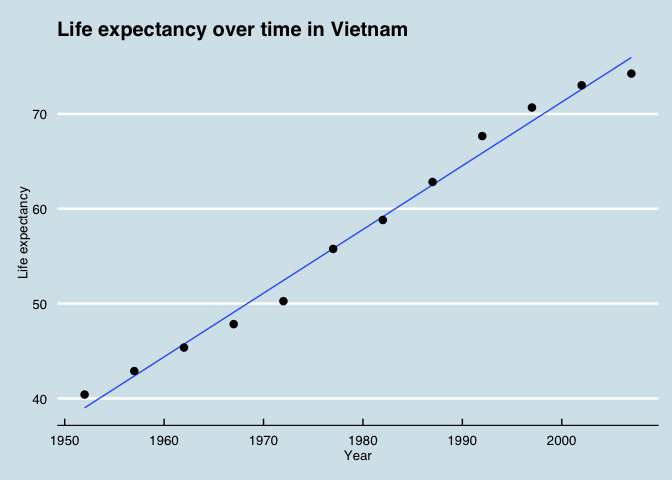
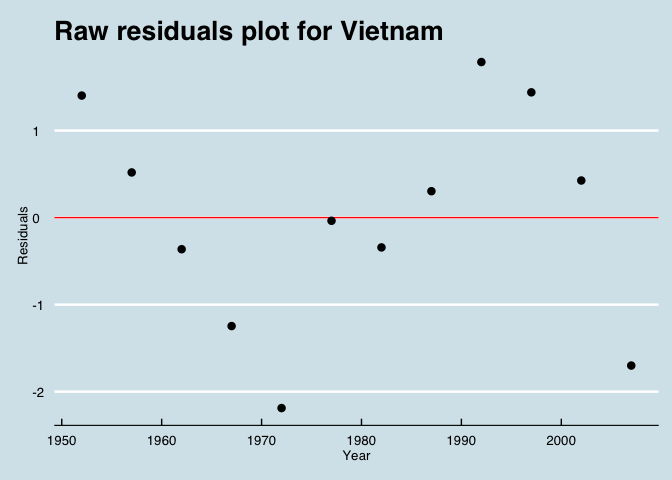

# HW 4: Using plyr to apply functions
Michelle Lee  
October 8, 2014  

### Purpose

The purpose was to:
* write one or more custom functions that do something useful to the Gapminder data
* use `plyr:ddply()` to apply to all such pieces
* use `dplyr` or `ggplot2` to explore what you got back


### Writing the functions

We first load the libraries and data.


#### Simple Linear Regression

I will try to create a function where I input the data and an offset year, and obtain the intercept and slope for two variables, life expectancy and year. 


```r
le.lm.fcn<- function(x, offset=1952){
  
  # checking
  assert_that(is.data.frame(x)) # test that it is a data frame
  assert_that(is.numeric(offset)) # test that it is a number
  
  # obtain data
  est.coefs <- coef(lm(lifeExp~I(year - offset),data=x))
  est.coefs <- as.data.frame(t(est.coefs))
  colnames(est.coefs) <- c("intercept","slope")
  return(est.coefs)
}
```

We can test this function with a smaller dataset, i.e. Vietnam. 


```r
vietnam <- subset(gDat, country=="Vietnam")
knitr::kable(le.lm.fcn(vietnam))
```


| intercept|  slope|
|---------:|------:|
|     39.01| 0.6716|

Let's check a plot to see if things really worked.


```r
ggplot(vietnam, aes(x = year, y = lifeExp)) + geom_point() + 
  geom_smooth(method = "lm", se = FALSE) + geom_point(lwd=3) + 
  xlab("Year") + ylab("Life expectancy") + theme(legend.position="none")+ 
  theme(plot.title = element_text(lineheight=.8, face="bold", size = 20))+ 
  ggtitle("Life expectancy over time in Vietnam") + theme_economist()
```

 

It looks fairly reasonable!


### Analyzing residuals, effects, and fitted values


```r
# types of residuals: standardized; studentized; and raw. 
res.fcn <- function(x, offset=1952, type = c("student", "standard", "raw")) {
  
  # check if everything works
    assert_that(is.data.frame(x))
    assert_that(is.string(type))
    assert_that(is.numeric(offset))
    
    # initial model results
    model <- lm(lifeExp~I(year - offset),data=x)
    effects <- model$effects
    fitted.vals <- model$fitted.values
    
    # what kind of residual
    if (type=="student") {
      res <- rstudent(model)
    } else if (type=="standard") {
      res <- rstandard(model)
    } else if (type=="raw") {
      res <- model$residuals
    } else 
      return("Sorry, this is not a proper residual type. Please pick one of the three: 'student', 'standard', or 'raw'.")
    
    # get final results
    results <- cbind(x$year, res, effects, fitted.vals)
    colnames(results) <- c("year", "residuals", "effects", "fitted values")
    return(results)
}
```


Let's try it on the Vietnam country data again.


```r
knitr::kable(head(res.fcn(vietnam, type="student"), n=5))
```


|     |      year| residuals|   effects| fitted values|
|:----|---------:|---------:|---------:|-------------:|
|1645 | 1952.0000|    1.3167| -199.1148|       39.0101|
|1646 | 1957.0000|    0.4300|   40.1568|       42.3682|
|1647 | 1962.0000|   -0.2891|   -0.7078|       45.7262|
|1648 | 1967.0000|   -1.0172|   -1.5774|       49.0843|
|1649 | 1972.0000|   -2.0016|   -2.5060|       52.4424|

```r
knitr::kable(head(res.fcn(vietnam, type="standard"), n=5))
```


|     |      year| residuals|   effects| fitted values|
|:----|---------:|---------:|---------:|-------------:|
|1645 | 1952.0000|    1.2709| -199.1148|       39.0101|
|1646 | 1957.0000|    0.4486|   40.1568|       42.3682|
|1647 | 1962.0000|   -0.3033|   -0.7078|       45.7262|
|1648 | 1967.0000|   -1.0154|   -1.5774|       49.0843|
|1649 | 1972.0000|   -1.7551|   -2.5060|       52.4424|

```r
knitr::kable(head(res.fcn(vietnam, type="raw"), n=5))
```


|     |      year| residuals|   effects| fitted values|
|:----|---------:|---------:|---------:|-------------:|
|1645 | 1952.0000|    1.4019| -199.1148|       39.0101|
|1646 | 1957.0000|    0.5188|   40.1568|       42.3682|
|1647 | 1962.0000|   -0.3632|   -0.7078|       45.7262|
|1648 | 1967.0000|   -1.2463|   -1.5774|       49.0843|
|1649 | 1972.0000|   -2.1884|   -2.5060|       52.4424|

It all works! Now let's test to make sure the `type` value works.


```r
head(res.fcn(vietnam, type="asdfasdf"), n=5)
```

```
## [1] "Sorry, this is not a proper residual type. Please pick one of the three: 'student', 'standard', or 'raw'."
```

```r
head(res.fcn(vietnam, type=555), n=5)
```

```
## Error: type is not a string (a length one character vector).
```

I think those are fairly reasonable error messages. Moving onto a plot, to make sure our residuals are reasonable. 


```r
raw.resid <- res.fcn(vietnam, type="raw")[,2]
ggplot(vietnam, aes(x = year, y = raw.resid)) + geom_point() + 
  geom_abline(slope = 0, color = "red") + geom_point(lwd=3) + 
  theme_economist() + ggtitle("Raw residuals plot for Vietnam") +
  xlab("Year") + ylab("Residuals") + theme(legend.position="none") + 
  theme(plot.title = element_text(lineheight=.8, face="bold", size = 20))
```

 

The residual plot for Vietnam fits with the values in the table above. Next, we will apply our functions to the entire Gapminder set.
