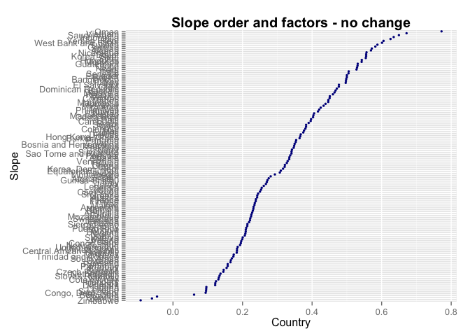
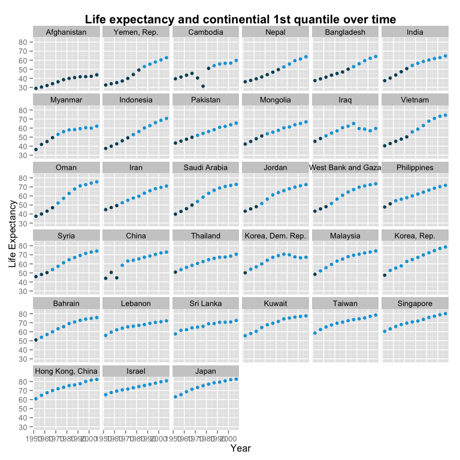

# HW 5: Factors and Files
Michelle Lee  
October 16, 2014  

## Prior tasks

```r
library(ggplot2)
library(ggthemes)
library(knitr)
library(reshape2)
library(plyr)
suppressPackageStartupMessages(library(dplyr))
gDat <- read.delim("gapminderDataFiveYear.txt")
gDat <- tbl_df(gDat)
```

## Drop Oceania

I used `droplevels` to remove unused factor levels. 

```r
hDat <- gDat %>%
  filter(!(continent %in% "Oceania")) %>%
  droplevels
```

We can compare the data before and after dropping Oceania, such as number of rows, number and identity of continents and countries.

```r
table<-matrix(ncol=2, nrow=3)
table<- rbind(cbind(nrow(gDat), nrow(hDat)), cbind(length(unique(gDat$continent)), length(unique(hDat$continent))), cbind(as.character(unique(gDat$continent)), as.character(unique(hDat$continent))))
```

```
## Warning: number of rows of result is not a multiple of vector length (arg
## 2)
```

```r
table[7,2]<-""
rownames(table) = c("Number of rows", "Number of continents", "Continents", "", "" ,"" ,"")
colnames(table) = c("Before", "After")
knitr::kable(table)
```


|                     |Before   |After    |
|:--------------------|:--------|:--------|
|Number of rows       |1704     |1680     |
|Number of continents |5        |4        |
|Continents           |Asia     |Asia     |
|                     |Europe   |Europe   |
|                     |Africa   |Africa   |
|                     |Americas |Americas |
|                     |Oceania  |         |

Above is a table with the descriptive statistics summarized.


## Model life expectancy as a function of year 

I used the code Jenny gave us.


```r
j_coefs <- ddply(gDat, ~ country + continent, function(dat, offset = 1952) {
  the_fit <- lm(lifeExp ~ I(year - offset), dat)
  setNames(coef(the_fit), c("intercept", "slope"))
})
```

Now we can look at the properties of `j_coefs`. 


```r
str(j_coefs)
```

```
## 'data.frame':	142 obs. of  4 variables:
##  $ country  : Factor w/ 142 levels "Afghanistan",..: 1 2 3 4 5 6 7 8 9 10 ...
##  $ continent: Factor w/ 5 levels "Africa","Americas",..: 3 4 1 1 2 5 4 3 3 4 ...
##  $ intercept: num  29.9 59.2 43.4 32.1 62.7 ...
##  $ slope    : num  0.275 0.335 0.569 0.209 0.232 ...
```

This tells us about the structure of `j_coefs` and what sort of data is provided, but it may be more interesting to see which countries have the highest and lowest levels. 


```r
knitr::kable(j_coefs %>%
  arrange(desc(slope)) %>%
  head)
```


|country      |continent | intercept|  slope|
|:------------|:---------|---------:|------:|
|Oman         |Asia      |     37.21| 0.7722|
|Vietnam      |Asia      |     39.01| 0.6716|
|Saudi Arabia |Asia      |     40.81| 0.6496|
|Indonesia    |Asia      |     36.88| 0.6346|
|Libya        |Africa    |     42.10| 0.6255|
|Yemen, Rep.  |Asia      |     30.13| 0.6055|

Now we can see the country with the highest slope is Oman. If we did it by intercept:


```r
knitr::kable(j_coefs %>%
  arrange(desc(intercept)) %>%
  head)
```


|country     |continent | intercept|  slope|
|:-----------|:---------|---------:|------:|
|Norway      |Europe    |     72.21| 0.1319|
|Iceland     |Europe    |     71.96| 0.1654|
|Netherlands |Europe    |     71.89| 0.1367|
|Sweden      |Europe    |     71.61| 0.1663|
|Denmark     |Europe    |     71.03| 0.1213|
|Switzerland |Europe    |     69.45| 0.2222|

Norway is the country with the highest intercept. Again, not particulary surprising.


## Order of data vs. order of factor levels

Jenny's code is given below:

```r
post_arrange <- j_coefs %>% arrange(slope)
post_reorder <- j_coefs %>%
  mutate(country = reorder(country, slope))
post_both <- j_coefs %>%
  mutate(country = reorder(country, slope)) %>%
  arrange(country)
```

Let's look at all three of these at once.


```r
head(post_arrange); head(post_reorder); head(post_both)
```

```
##            country continent intercept    slope
## 1         Zimbabwe    Africa     55.22 -0.09302
## 2           Zambia    Africa     47.66 -0.06043
## 3           Rwanda    Africa     42.74 -0.04583
## 4         Botswana    Africa     52.93  0.06067
## 5 Congo, Dem. Rep.    Africa     41.96  0.09392
## 6        Swaziland    Africa     46.39  0.09507
```

```
##       country continent intercept  slope
## 1 Afghanistan      Asia     29.91 0.2753
## 2     Albania    Europe     59.23 0.3347
## 3     Algeria    Africa     43.37 0.5693
## 4      Angola    Africa     32.13 0.2093
## 5   Argentina  Americas     62.69 0.2317
## 6   Australia   Oceania     68.40 0.2277
```

```
##            country continent intercept    slope
## 1         Zimbabwe    Africa     55.22 -0.09302
## 2           Zambia    Africa     47.66 -0.06043
## 3           Rwanda    Africa     42.74 -0.04583
## 4         Botswana    Africa     52.93  0.06067
## 5 Congo, Dem. Rep.    Africa     41.96  0.09392
## 6        Swaziland    Africa     46.39  0.09507
```

`post_arrange` and `post_both` look the same. We can look at these one by one.

### post_arrange


```r
head(post_arrange); tail(post_arrange)
```

```
##            country continent intercept    slope
## 1         Zimbabwe    Africa     55.22 -0.09302
## 2           Zambia    Africa     47.66 -0.06043
## 3           Rwanda    Africa     42.74 -0.04583
## 4         Botswana    Africa     52.93  0.06067
## 5 Congo, Dem. Rep.    Africa     41.96  0.09392
## 6        Swaziland    Africa     46.39  0.09507
```

```
##          country continent intercept  slope
## 137  Yemen, Rep.      Asia     30.13 0.6055
## 138        Libya    Africa     42.10 0.6255
## 139    Indonesia      Asia     36.88 0.6346
## 140 Saudi Arabia      Asia     40.81 0.6496
## 141      Vietnam      Asia     39.01 0.6716
## 142         Oman      Asia     37.21 0.7722
```

We can clearly see that `post_arrange` sorted the data according to increasing order of slope. 

### post_reorder


```r
head(post_reorder); tail(post_reorder)
```

```
##       country continent intercept  slope
## 1 Afghanistan      Asia     29.91 0.2753
## 2     Albania    Europe     59.23 0.3347
## 3     Algeria    Africa     43.37 0.5693
## 4      Angola    Africa     32.13 0.2093
## 5   Argentina  Americas     62.69 0.2317
## 6   Australia   Oceania     68.40 0.2277
```

```
##                country continent intercept    slope
## 137          Venezuela  Americas     57.51  0.32972
## 138            Vietnam      Asia     39.01  0.67162
## 139 West Bank and Gaza      Asia     43.80  0.60110
## 140        Yemen, Rep.      Asia     30.13  0.60546
## 141             Zambia    Africa     47.66 -0.06043
## 142           Zimbabwe    Africa     55.22 -0.09302
```

Here, we can see that `country` is organized alphabetically first, and then slope after. Because `mutate` is used, we know that the `country` factor has been reordered. 


```r
table2<- head(cbind((levels(j_coefs$country)),(levels(post_reorder$country)), as.data.frame(post_reorder$slope)), n=10)
colnames(table2) = c("Levels before", "Levels after", "Slope")
knitr::kable(table2)
```


|Levels before |Levels after     |  Slope|
|:-------------|:----------------|------:|
|Afghanistan   |Zimbabwe         | 0.2753|
|Albania       |Zambia           | 0.3347|
|Algeria       |Rwanda           | 0.5693|
|Angola        |Botswana         | 0.2093|
|Argentina     |Congo, Dem. Rep. | 0.2317|
|Australia     |Swaziland        | 0.2277|
|Austria       |Lesotho          | 0.2420|
|Bahrain       |Liberia          | 0.4675|
|Bangladesh    |Denmark          | 0.4981|
|Belgium       |Uganda           | 0.2091|

Now we can see that alphabetical order isn't how the levels are ordered now - it is by slope. We know that it's not just simple sorting, but an actual change in levels, through ggplot. I'll use the chart Jenny showed us in class:


```r
ggplot(post_arrange, aes(x = slope, y = country)) + geom_point(size = 1.2, colour="purple") + 
      ggtitle ("Slope order and factors - no change") + guides(fill = F) + 
  theme(plot.title = element_text(lineheight=.8, face="bold", size = 15)) + 
  xlab("Country") + ylab("Slope")
```

 

This is `post_arrange`, where the data was sorted but **not** with reordered factor levels. Below is `post_reorder`, which is clearly reordered:


```r
ggplot(post_reorder, aes(x = slope, y = country)) + geom_point(size = 1.2, colour="dark blue") + 
      ggtitle ("Slope order and factors - no change") + guides(fill = F) + 
  theme(plot.title = element_text(lineheight=.8, face="bold", size = 15)) + 
  xlab("Country") + ylab("Slope")
```

 

### post_booth

`post_booth` combines both previous objects; it mutates the country level first, and then arranges it by country, which is why it looked identical to `post_arrange` (although by no means the same!) We can convince ourselves of this by checking:


```r
identical(post_both, post_arrange)
```

```
## [1] FALSE
```

Great! Now we can check the levels:

```r
table3<- head(cbind((levels(post_arrange$country)),(levels(post_both$country))), n=10)
colnames(table3) = c("Levels for post_arrange", "Levels for post_both")
knitr::kable(table3)
```


|Levels for post_arrange |Levels for post_both |
|:-----------------------|:--------------------|
|Afghanistan             |Zimbabwe             |
|Albania                 |Zambia               |
|Algeria                 |Rwanda               |
|Angola                  |Botswana             |
|Argentina               |Congo, Dem. Rep.     |
|Australia               |Swaziland            |
|Austria                 |Lesotho              |
|Bahrain                 |Liberia              |
|Bangladesh              |Denmark              |
|Belgium                 |Uganda               |

We can see that the two are again very different, because of the reordered factors. What about `post_reorder`?


```r
table3<- head(cbind((levels(post_reorder$country)),(levels(post_both$country))), n=10)
colnames(table3) = c("Levels for post_reorder", "Levels for post_both")
knitr::kable(table3)
```


|Levels for post_reorder |Levels for post_both |
|:-----------------------|:--------------------|
|Zimbabwe                |Zimbabwe             |
|Zambia                  |Zambia               |
|Rwanda                  |Rwanda               |
|Botswana                |Botswana             |
|Congo, Dem. Rep.        |Congo, Dem. Rep.     |
|Swaziland               |Swaziland            |
|Lesotho                 |Lesotho              |
|Liberia                 |Liberia              |
|Denmark                 |Denmark              |
|Uganda                  |Uganda               |

The levels are the same...

```r
identical(post_reorder, post_both)
```

```
## [1] FALSE
```

... but they are not identical. This can be easily checked again:


```r
head(post_reorder); head(post_both)
```

```
##       country continent intercept  slope
## 1 Afghanistan      Asia     29.91 0.2753
## 2     Albania    Europe     59.23 0.3347
## 3     Algeria    Africa     43.37 0.5693
## 4      Angola    Africa     32.13 0.2093
## 5   Argentina  Americas     62.69 0.2317
## 6   Australia   Oceania     68.40 0.2277
```

```
##            country continent intercept    slope
## 1         Zimbabwe    Africa     55.22 -0.09302
## 2           Zambia    Africa     47.66 -0.06043
## 3           Rwanda    Africa     42.74 -0.04583
## 4         Botswana    Africa     52.93  0.06067
## 5 Congo, Dem. Rep.    Africa     41.96  0.09392
## 6        Swaziland    Africa     46.39  0.09507
```

Again, it is clear that `post_both` rearranges the levels like `post_reorder`, but arranges the country order to look like `post_arrange`. 

### In the definition of post_both, if I swapped out arrange(country) for arrange(slope), would I get the same result?


```r
pb2<- post_both %>%
  arrange(slope)
identical(post_both, pb2)
```

```
## [1] TRUE
```

Yes, they are identical, because `arrange` is simply changing how the data is presented, but nothing else at a deeper level. 

### What if the reorder() command got changed?

Let's try changing it to `reorder(country, intercept)`. 


```r
pb2<- j_coefs %>%
  mutate(country = reorder(country, intercept)) %>%
  arrange(country) 
table4<- head(cbind((levels(post_both$country)),(levels(pb2$country)), as.data.frame(pb2$intercept)), n=10)
colnames(table4) = c("Levels for post_both", "Levels for post_both changed", "PB changed intercept")
knitr::kable(table4)
```


|Levels for post_both |Levels for post_both changed | PB changed intercept|
|:--------------------|:----------------------------|--------------------:|
|Zimbabwe             |Gambia                       |                28.40|
|Zambia               |Afghanistan                  |                29.91|
|Rwanda               |Yemen, Rep.                  |                30.13|
|Botswana             |Sierra Leone                 |                30.88|
|Congo, Dem. Rep.     |Guinea                       |                31.56|
|Swaziland            |Guinea-Bissau                |                31.74|
|Lesotho              |Angola                       |                32.13|
|Liberia              |Mali                         |                33.05|
|Denmark              |Mozambique                   |                34.21|
|Uganda               |Equatorial Guinea            |                34.43|

It's clear that the changed post_booth is by intercept. 


### Do you have any preference for one arrange statement over the other?

It really depends on which factor you want to concentrate on. `ggplot` doesn't plot well without factors being reordered, so it would make sense to reorder the factor of interest. 


## Revalue a factor 


```r
countries<- c("Korea, Rep.", "United States", "Japan", "Canada", "India", "Iceland")
countries2 <- gDat %>%
  filter(country %in% countries) %>%
  droplevels
new_countries<-c("Korea, Rep." = "Where I was born", "United States" = "Where I went next", "Japan" = "Where I went after that", "Canada" = "Where I went to high school", "India" = "Where I went backpacking and got lost", "Iceland" = "Where I hope to explore fjords")
places <- revalue(countries2$country, new_countries)
```

To make sure that our factors have been revalued:


```r
mDat <- gDat %>%
  filter(country %in% countries) %>%
  mutate(new_factor = revalue(countries2$country, new_countries)) %>%
  select(country, new_factor)
knitr::kable(unique(mDat))
```


|   |country       |new_factor                            |
|:--|:-------------|:-------------------------------------|
|1  |Canada        |Where I went to high school           |
|13 |Iceland       |Where I hope to explore fjords        |
|25 |India         |Where I went backpacking and got lost |
|37 |Japan         |Where I went after that               |
|49 |Korea, Rep.   |Where I was born                      |
|61 |United States |Where I went next                     |

The levels have been changed! 


## Reorder a factor

`ggplot` doesn't allow you to change the order in which countries are plotted, unless the factor is changed. Here, I changed the factor level such that the countries are organized by life expectancy in 1952, in ascending order.


```r
asia <- gDat %>%
  mutate(country = reorder(country, lifeExp))  %>% # reorder by life expectancy! 
  filter(continent=="Asia") %>%
  select(country, year, lifeExp) %>%
  droplevels

ggplot(asia, aes(x = year, y = lifeExp, colour = lifeExp < quantile(asia$lifeExp, 0.25))) + # by 1st quartile life expectancy
  geom_point(aes(group=year)) + facet_wrap(~ country) + 
  ggtitle("Life expectancy and continential 1st quantile over time") + 
  theme(legend.position="none", plot.title = element_text(size = 15, face="bold")) + 
  xlab("Year") + ylab("Life Expectancy") + scale_color_economist()
```

 

The data has now been reordered, so that the plot starts with the country with the lowest life expectancy in 1952 (Afghanistan) to the highest (Japan). The point when a country turns from dark to light blue indicates when they were no longer within the 1st quantile of life expectancy.


## Write and read data to file


### write.table, read.table


First, let's test write and read.table.


```r
# export and import using test data
countries<- c("Afghanistan", "Canada", "Iceland", "Japan", "Sweden")
testData <- gDat %>% 
  filter(country %in% countries)  %>%
  as.data.frame %>%
  droplevels
write.table(testData, "testData.csv", sep=" ", row.names=F, quote=F)
check.table<- read.csv("testData.csv", sep=" ", header=T)
identical(testData, check.table)
```

```
## [1] FALSE
```

The two aren't the same. If we take a closer look:


```r
str(testData); str(check.table)
```

```
## 'data.frame':	60 obs. of  6 variables:
##  $ country  : Factor w/ 5 levels "Afghanistan",..: 1 1 1 1 1 1 1 1 1 1 ...
##  $ year     : int  1952 1957 1962 1967 1972 1977 1982 1987 1992 1997 ...
##  $ pop      : num  8425333 9240934 10267083 11537966 13079460 ...
##  $ continent: Factor w/ 3 levels "Americas","Asia",..: 2 2 2 2 2 2 2 2 2 2 ...
##  $ lifeExp  : num  28.8 30.3 32 34 36.1 ...
##  $ gdpPercap: num  779 821 853 836 740 ...
```

```
## 'data.frame':	60 obs. of  6 variables:
##  $ country  : Factor w/ 5 levels "Afghanistan",..: 1 1 1 1 1 1 1 1 1 1 ...
##  $ year     : int  1952 1957 1962 1967 1972 1977 1982 1987 1992 1997 ...
##  $ pop      : int  8425333 9240934 10267083 11537966 13079460 14880372 12881816 13867957 16317921 22227415 ...
##  $ continent: Factor w/ 3 levels "Americas","Asia",..: 2 2 2 2 2 2 2 2 2 2 ...
##  $ lifeExp  : num  28.8 30.3 32 34 36.1 ...
##  $ gdpPercap: num  779 821 853 836 740 ...
```

The difference is that population is an integer for `check.table`, instead of number for `testData`. If we try fixing that:


```r
check.table$pop<-as.numeric(check.table$pop)
identical(testData, check.table)
```

```
## [1] TRUE
```

Sure enough, they are identical now!


### RDS
 
Let's try saving as an RDS object.


```r
saveRDS(testData, "testData.rds")
# import and try testing it
checkRDS<- readRDS("testData.rds")
identical(testData, checkRDS)
```

```
## [1] TRUE
```

Exporting and re-importing an RDS file is significantly easier than it is for a csv - with write and read.table, you have to worry about whether strings have commas, the class of numbers, and so on. 


### dput


```r
dput(testData,"testData.txt")
# import it back 
checkDGet <- dget("testData.txt")
identical(testData, checkDGet)
```

```
## [1] TRUE
```

Again, it is identical.

### Which is better?

After trying all three methods, I think RDS is the most convenient. It keeps the level order and there is less to worry about the data behaving badly when it is exported and imported it back. 

### Naming conventions?

If it is a file I will be accessing frequently, I often name it by date, because it is easiest for me to pick out from a list of files. However, if it is a file I will be returning to much later, then I would rename it to something more descriptive. Now that I've learned about RDS objects, I'll be definitely using it more, rather than exporting to csv's!


## Report your process

* Reordering the factors was easy once I learned the methods. It's wonderful how convenient `dplyr` is, and how easy it makes organizing and munging data.
* Difficult: exporting and importing csv's, especially if the country names have commas and other punctuation that bring all sorts of grief. RDS files are so much better to work with.
