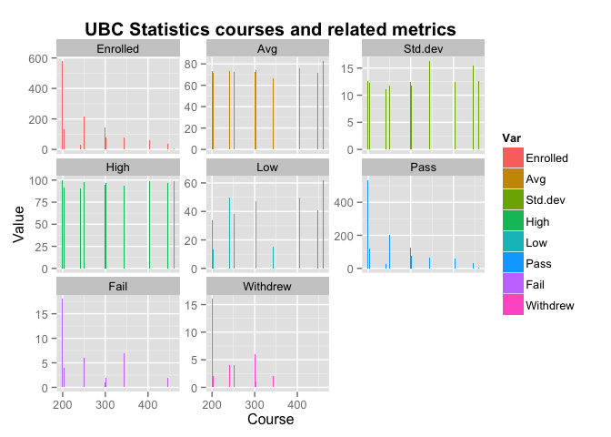
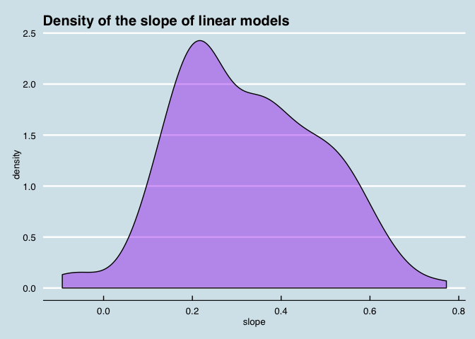
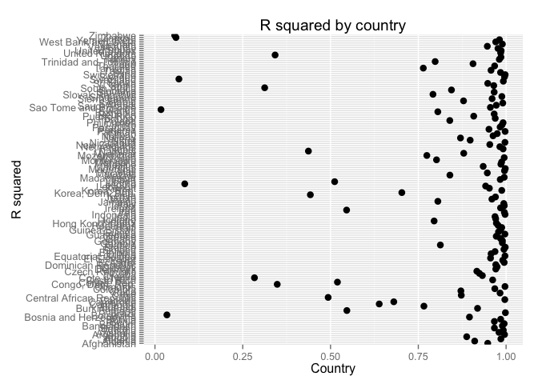
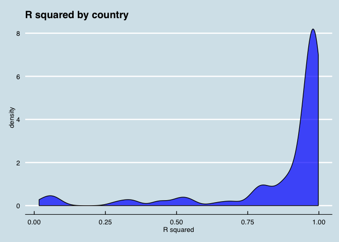
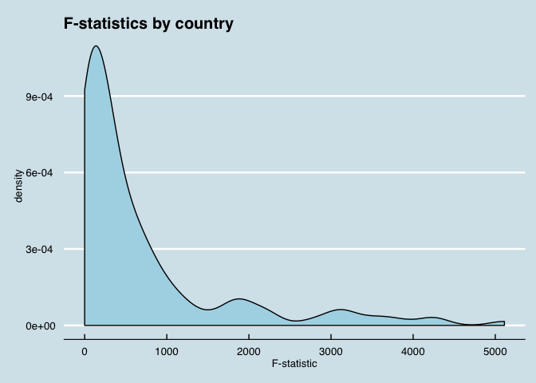

# Homework 7: Data wranging - the grand finale
Michelle Lee  
Oct 31, 2014  


This is Homework 7: data wrangling. 

# Prior tasks

```r
library(ggplot2)
library(reshape2)
library(plyr)
library(tidyr)
library(knitr)
library(ggthemes)
suppressPackageStartupMessages(library(dplyr))
gDat <- read.delim("gapminderDataFiveYear.txt")
```

I'll start with the easiest task, changing the data from one shape to another. 

# General data reshaping and relationship 

For this, I'll use a dataset from UBC's PAIR website: grades from all UBC STAT classes, along with some other information. It is in 'wide' format classic to most datasets meant for easy reading, but not so much for analysis. 

To make it a bit easier, I'll add some filters. 


```r
stat <- read.csv("STAT.csv")
# keep only certain sections of the data
kable(stat <- stat %>%
  filter(Section=="OVERALL") %>%
  select(Subject, Course, Title, Enrolled, Avg, Std.dev, High, Low, Pass, Fail, Withdrew) %>%
  filter(as.numeric(Course) < 500) %>%
  na.omit)
```


|   |Subject | Course|Title            | Enrolled|   Avg| Std.dev| High| Low| Pass| Fail| Withdrew|
|:--|:-------|------:|:----------------|--------:|-----:|-------:|----:|---:|----:|----:|--------:|
|1  |STAT    |    200|ELEM STAT APPLIC |      579| 73.12|   12.63|  100|  34|  534|   18|       16|
|2  |STAT    |    203|STATISTICAL MTHD |      131| 71.91|   12.29|   92|  13|  121|    4|        2|
|3  |STAT    |    241|INTRO PROB&STATS |       33| 73.71|   11.18|   91|  50|   28|    0|        4|
|4  |STAT    |    251|ELEM STATISTICS  |      218| 72.39|   11.80|   98|  38|  204|    6|        4|
|5  |STAT    |    300|INT STATS APPLIC |      142| 72.13|   12.48|   95|   0|  128|    1|        6|
|6  |STAT    |    302|INTR PROBABILITY |       79| 74.53|   11.73|   97|  47|   75|    2|        1|
|9  |STAT    |    344|SAMPLE SURVEYS   |       79| 66.68|   16.28|   94|  15|   67|    7|        2|
|10 |STAT    |    404|DSGN&ANL EXPERMT |       60| 75.67|   12.42|   99|  50|   57|    0|        0|
|11 |STAT    |    447|SPECIAL TOPICS   |       35| 71.91|   15.51|   97|  41|   31|    2|        0|
|12 |STAT    |    447|SPECIAL TOPICS   |       35| 71.91|   15.51|   97|  41|   31|    2|        0|
|13 |STAT    |    460|STAT INFRNCE I   |        7| 82.57|   12.55|   99|  62|    7|    0|        0|

In typical wide format. Using `gather`...


```r
# transform data from wide to long
kable(stat<-gather(stat, key="Var", value="Value", Enrolled, Avg, Std.dev, High, Low, Pass, Fail, Withdrew))
```


|Subject | Course|Title            |Var      |  Value|
|:-------|------:|:----------------|:--------|------:|
|STAT    |    200|ELEM STAT APPLIC |Enrolled | 579.00|
|STAT    |    203|STATISTICAL MTHD |Enrolled | 131.00|
|STAT    |    241|INTRO PROB&STATS |Enrolled |  33.00|
|STAT    |    251|ELEM STATISTICS  |Enrolled | 218.00|
|STAT    |    300|INT STATS APPLIC |Enrolled | 142.00|
|STAT    |    302|INTR PROBABILITY |Enrolled |  79.00|
|STAT    |    344|SAMPLE SURVEYS   |Enrolled |  79.00|
|STAT    |    404|DSGN&ANL EXPERMT |Enrolled |  60.00|
|STAT    |    447|SPECIAL TOPICS   |Enrolled |  35.00|
|STAT    |    447|SPECIAL TOPICS   |Enrolled |  35.00|
|STAT    |    460|STAT INFRNCE I   |Enrolled |   7.00|
|STAT    |    200|ELEM STAT APPLIC |Avg      |  73.12|
|STAT    |    203|STATISTICAL MTHD |Avg      |  71.91|
|STAT    |    241|INTRO PROB&STATS |Avg      |  73.71|
|STAT    |    251|ELEM STATISTICS  |Avg      |  72.39|
|STAT    |    300|INT STATS APPLIC |Avg      |  72.13|
|STAT    |    302|INTR PROBABILITY |Avg      |  74.53|
|STAT    |    344|SAMPLE SURVEYS   |Avg      |  66.68|
|STAT    |    404|DSGN&ANL EXPERMT |Avg      |  75.67|
|STAT    |    447|SPECIAL TOPICS   |Avg      |  71.91|
|STAT    |    447|SPECIAL TOPICS   |Avg      |  71.91|
|STAT    |    460|STAT INFRNCE I   |Avg      |  82.57|
|STAT    |    200|ELEM STAT APPLIC |Std.dev  |  12.63|
|STAT    |    203|STATISTICAL MTHD |Std.dev  |  12.29|
|STAT    |    241|INTRO PROB&STATS |Std.dev  |  11.18|
|STAT    |    251|ELEM STATISTICS  |Std.dev  |  11.80|
|STAT    |    300|INT STATS APPLIC |Std.dev  |  12.48|
|STAT    |    302|INTR PROBABILITY |Std.dev  |  11.73|
|STAT    |    344|SAMPLE SURVEYS   |Std.dev  |  16.28|
|STAT    |    404|DSGN&ANL EXPERMT |Std.dev  |  12.42|
|STAT    |    447|SPECIAL TOPICS   |Std.dev  |  15.51|
|STAT    |    447|SPECIAL TOPICS   |Std.dev  |  15.51|
|STAT    |    460|STAT INFRNCE I   |Std.dev  |  12.55|
|STAT    |    200|ELEM STAT APPLIC |High     | 100.00|
|STAT    |    203|STATISTICAL MTHD |High     |  92.00|
|STAT    |    241|INTRO PROB&STATS |High     |  91.00|
|STAT    |    251|ELEM STATISTICS  |High     |  98.00|
|STAT    |    300|INT STATS APPLIC |High     |  95.00|
|STAT    |    302|INTR PROBABILITY |High     |  97.00|
|STAT    |    344|SAMPLE SURVEYS   |High     |  94.00|
|STAT    |    404|DSGN&ANL EXPERMT |High     |  99.00|
|STAT    |    447|SPECIAL TOPICS   |High     |  97.00|
|STAT    |    447|SPECIAL TOPICS   |High     |  97.00|
|STAT    |    460|STAT INFRNCE I   |High     |  99.00|
|STAT    |    200|ELEM STAT APPLIC |Low      |  34.00|
|STAT    |    203|STATISTICAL MTHD |Low      |  13.00|
|STAT    |    241|INTRO PROB&STATS |Low      |  50.00|
|STAT    |    251|ELEM STATISTICS  |Low      |  38.00|
|STAT    |    300|INT STATS APPLIC |Low      |   0.00|
|STAT    |    302|INTR PROBABILITY |Low      |  47.00|
|STAT    |    344|SAMPLE SURVEYS   |Low      |  15.00|
|STAT    |    404|DSGN&ANL EXPERMT |Low      |  50.00|
|STAT    |    447|SPECIAL TOPICS   |Low      |  41.00|
|STAT    |    447|SPECIAL TOPICS   |Low      |  41.00|
|STAT    |    460|STAT INFRNCE I   |Low      |  62.00|
|STAT    |    200|ELEM STAT APPLIC |Pass     | 534.00|
|STAT    |    203|STATISTICAL MTHD |Pass     | 121.00|
|STAT    |    241|INTRO PROB&STATS |Pass     |  28.00|
|STAT    |    251|ELEM STATISTICS  |Pass     | 204.00|
|STAT    |    300|INT STATS APPLIC |Pass     | 128.00|
|STAT    |    302|INTR PROBABILITY |Pass     |  75.00|
|STAT    |    344|SAMPLE SURVEYS   |Pass     |  67.00|
|STAT    |    404|DSGN&ANL EXPERMT |Pass     |  57.00|
|STAT    |    447|SPECIAL TOPICS   |Pass     |  31.00|
|STAT    |    447|SPECIAL TOPICS   |Pass     |  31.00|
|STAT    |    460|STAT INFRNCE I   |Pass     |   7.00|
|STAT    |    200|ELEM STAT APPLIC |Fail     |  18.00|
|STAT    |    203|STATISTICAL MTHD |Fail     |   4.00|
|STAT    |    241|INTRO PROB&STATS |Fail     |   0.00|
|STAT    |    251|ELEM STATISTICS  |Fail     |   6.00|
|STAT    |    300|INT STATS APPLIC |Fail     |   1.00|
|STAT    |    302|INTR PROBABILITY |Fail     |   2.00|
|STAT    |    344|SAMPLE SURVEYS   |Fail     |   7.00|
|STAT    |    404|DSGN&ANL EXPERMT |Fail     |   0.00|
|STAT    |    447|SPECIAL TOPICS   |Fail     |   2.00|
|STAT    |    447|SPECIAL TOPICS   |Fail     |   2.00|
|STAT    |    460|STAT INFRNCE I   |Fail     |   0.00|
|STAT    |    200|ELEM STAT APPLIC |Withdrew |  16.00|
|STAT    |    203|STATISTICAL MTHD |Withdrew |   2.00|
|STAT    |    241|INTRO PROB&STATS |Withdrew |   4.00|
|STAT    |    251|ELEM STATISTICS  |Withdrew |   4.00|
|STAT    |    300|INT STATS APPLIC |Withdrew |   6.00|
|STAT    |    302|INTR PROBABILITY |Withdrew |   1.00|
|STAT    |    344|SAMPLE SURVEYS   |Withdrew |   2.00|
|STAT    |    404|DSGN&ANL EXPERMT |Withdrew |   0.00|
|STAT    |    447|SPECIAL TOPICS   |Withdrew |   0.00|
|STAT    |    447|SPECIAL TOPICS   |Withdrew |   0.00|
|STAT    |    460|STAT INFRNCE I   |Withdrew |   0.00|

... transformed to long! I wish I had known about `gather` before - it's now a ridiculously easy process. Here's a plot:


```r
# plot barplots of various values 
ggplot(stat, aes(x=Course, y=Value, fill=Var)) + 
  geom_bar(stat="identity", position="dodge") + 
  facet_wrap(~Var, scales="free_y") + 
  ggtitle("UBC Statistics courses and related metrics") + 
  theme(plot.title = element_text(lineheight=.8, face="bold", size = 15))
```

 

As the course code increases (e.g. courses become more advanced), the enrollment number drops, lowest grade increases, fail and withdrawal rate decreases. 


# Join, merge, look up

I made my own dplyr join functions cheatsheet. 

## Data aggregation

I used `dlply` to enact linear regression on each Gapminder country -  without separating the data frame into numerous smaller ones!


```r
# make a function for dlply
aggfcn<- function(data, offset=1952) {
  model1<- lm(lifeExp~ I(year-offset), data)
}
# get the first few lm objects
head(dlply(gDat, ~country, aggfcn))
```

```
## $Afghanistan
## 
## Call:
## lm(formula = lifeExp ~ I(year - offset), data = data)
## 
## Coefficients:
##      (Intercept)  I(year - offset)  
##           29.907             0.275  
## 
## 
## $Albania
## 
## Call:
## lm(formula = lifeExp ~ I(year - offset), data = data)
## 
## Coefficients:
##      (Intercept)  I(year - offset)  
##           59.229             0.335  
## 
## 
## $Algeria
## 
## Call:
## lm(formula = lifeExp ~ I(year - offset), data = data)
## 
## Coefficients:
##      (Intercept)  I(year - offset)  
##           43.375             0.569  
## 
## 
## $Angola
## 
## Call:
## lm(formula = lifeExp ~ I(year - offset), data = data)
## 
## Coefficients:
##      (Intercept)  I(year - offset)  
##           32.127             0.209  
## 
## 
## $Argentina
## 
## Call:
## lm(formula = lifeExp ~ I(year - offset), data = data)
## 
## Coefficients:
##      (Intercept)  I(year - offset)  
##           62.688             0.232  
## 
## 
## $Australia
## 
## Call:
## lm(formula = lifeExp ~ I(year - offset), data = data)
## 
## Coefficients:
##      (Intercept)  I(year - offset)  
##           68.401             0.228
```

Instead of a table of coefficient, we have actual lm objects! We can look into the object, though beware of using `str` on this. 


```r
cdat<-dlply(gDat, ~country, aggfcn)
class(cdat)
```

```
## [1] "list"
```

```r
length(cdat)
```

```
## [1] 142
```

A summary of the data isn't particularly helpful, either - the information we really want is harder to access.


```r
kable(head(summary(cdat)))
```


|            |Length |Class |Mode |
|:-----------|:------|:-----|:----|
|Afghanistan |12     |lm    |list |
|Albania     |12     |lm    |list |
|Algeria     |12     |lm    |list |
|Angola      |12     |lm    |list |
|Argentina   |12     |lm    |list |
|Australia   |12     |lm    |list |

Let's try looking at information for just one country.


```r
# filter by Sweden only
swed<-cdat[["Sweden"]]
str(swed)
```

```
## List of 12
##  $ coefficients : Named num [1:2] 71.605 0.166
##   ..- attr(*, "names")= chr [1:2] "(Intercept)" "I(year - offset)"
##  $ residuals    : Named num [1:12] 0.255 0.0537 0.1025 0.0612 -0.2101 ...
##   ..- attr(*, "names")= chr [1:12] "1" "2" "3" "4" ...
##  $ effects      : Named num [1:12] -2.64e+02 9.94 4.58e-02 4.34e-03 -2.67e-01 ...
##   ..- attr(*, "names")= chr [1:12] "(Intercept)" "I(year - offset)" "" "" ...
##  $ rank         : int 2
##  $ fitted.values: Named num [1:12] 71.6 72.4 73.3 74.1 74.9 ...
##   ..- attr(*, "names")= chr [1:12] "1" "2" "3" "4" ...
##  $ assign       : int [1:2] 0 1
##  $ qr           :List of 5
##   ..$ qr   : num [1:12, 1:2] -3.464 0.289 0.289 0.289 0.289 ...
##   .. ..- attr(*, "dimnames")=List of 2
##   .. .. ..$ : chr [1:12] "1" "2" "3" "4" ...
##   .. .. ..$ : chr [1:2] "(Intercept)" "I(year - offset)"
##   .. ..- attr(*, "assign")= int [1:2] 0 1
##   ..$ qraux: num [1:2] 1.29 1.27
##   ..$ pivot: int [1:2] 1 2
##   ..$ tol  : num 1e-07
##   ..$ rank : int 2
##   ..- attr(*, "class")= chr "qr"
##  $ df.residual  : int 10
##  $ xlevels      : Named list()
##  $ call         : language lm(formula = lifeExp ~ I(year - offset), data = data)
##  $ terms        :Classes 'terms', 'formula' length 3 lifeExp ~ I(year - offset)
##   .. ..- attr(*, "variables")= language list(lifeExp, I(year - offset))
##   .. ..- attr(*, "factors")= int [1:2, 1] 0 1
##   .. .. ..- attr(*, "dimnames")=List of 2
##   .. .. .. ..$ : chr [1:2] "lifeExp" "I(year - offset)"
##   .. .. .. ..$ : chr "I(year - offset)"
##   .. ..- attr(*, "term.labels")= chr "I(year - offset)"
##   .. ..- attr(*, "order")= int 1
##   .. ..- attr(*, "intercept")= int 1
##   .. ..- attr(*, "response")= int 1
##   .. ..- attr(*, ".Environment")=<environment: 0x7fa7a611fc30> 
##   .. ..- attr(*, "predvars")= language list(lifeExp, I(year - offset))
##   .. ..- attr(*, "dataClasses")= Named chr [1:2] "numeric" "numeric"
##   .. .. ..- attr(*, "names")= chr [1:2] "lifeExp" "I(year - offset)"
##  $ model        :'data.frame':	12 obs. of  2 variables:
##   ..$ lifeExp         : num [1:12] 71.9 72.5 73.4 74.2 74.7 ...
##   ..$ I(year - offset):Class 'AsIs'  num [1:12] 0 5 10 15 20 25 30 35 40 45 ...
##   ..- attr(*, "terms")=Classes 'terms', 'formula' length 3 lifeExp ~ I(year - offset)
##   .. .. ..- attr(*, "variables")= language list(lifeExp, I(year - offset))
##   .. .. ..- attr(*, "factors")= int [1:2, 1] 0 1
##   .. .. .. ..- attr(*, "dimnames")=List of 2
##   .. .. .. .. ..$ : chr [1:2] "lifeExp" "I(year - offset)"
##   .. .. .. .. ..$ : chr "I(year - offset)"
##   .. .. ..- attr(*, "term.labels")= chr "I(year - offset)"
##   .. .. ..- attr(*, "order")= int 1
##   .. .. ..- attr(*, "intercept")= int 1
##   .. .. ..- attr(*, "response")= int 1
##   .. .. ..- attr(*, ".Environment")=<environment: 0x7fa7a611fc30> 
##   .. .. ..- attr(*, "predvars")= language list(lifeExp, I(year - offset))
##   .. .. ..- attr(*, "dataClasses")= Named chr [1:2] "numeric" "numeric"
##   .. .. .. ..- attr(*, "names")= chr [1:2] "lifeExp" "I(year - offset)"
##  - attr(*, "class")= chr "lm"
```

We can see that there are a number of things we can access - coefficients, residuals, and so on. We can use `ldply` to get all the coefficients we want into a neater looking table. For example,


```r
# get a table of coefficients
kable(head(ldply(cdat, coefficients)))
```


|country     | (Intercept)| I(year - offset)|
|:-----------|-----------:|----------------:|
|Afghanistan |       29.91|           0.2753|
|Albania     |       59.23|           0.3347|
|Algeria     |       43.38|           0.5693|
|Angola      |       32.13|           0.2093|
|Argentina   |       62.69|           0.2317|
|Australia   |       68.40|           0.2277|

or,

```r
# get a table of residuals
kable(head(ldply(cdat, residuals)))
```


|country     |       1|       2|       3|       4|       5|       6|       7|       8|       9|      10|      11|      12|
|:-----------|-------:|-------:|-------:|-------:|-------:|-------:|-------:|-------:|-------:|-------:|-------:|-------:|
|Afghanistan | -1.1063| -0.9519| -0.6636| -0.0172|  0.6741|  1.6475|  1.6868|  1.2782|  0.7536| -0.5341| -1.5447| -1.2224|
|Albania     | -3.9991| -1.6225|  2.2440|  1.9706|  1.7672|  1.3338|  1.1504|  1.0570| -1.0355| -1.3399| -0.3123| -1.2137|
|Algeria     | -0.2980| -0.5364| -0.7648| -0.5072| -0.2426|  0.4070|  0.9146|  2.4992|  1.5978|  0.1594| -0.8450| -2.3844|
|Angola      | -2.1117| -1.1744| -0.2201|  0.7182|  1.6145|  2.1228|  1.5352|  0.4525|  0.1468| -0.5839| -1.5906| -0.9093|
|Argentina   | -0.2034|  0.5520|  0.1365| -0.5301| -0.2576| -0.0001|  0.3023| -0.0242| -0.0888|  0.1597|  0.0661| -0.1124|
|Australia   |  0.7195|  0.7909|  0.2522| -0.7164| -1.0250| -0.6036| -0.4922| -0.0508|  0.0505|  0.1819|  0.5833|  0.3097|


We can plot the density of the slopes:


```r
# plot the density of the slopes
coef<-ldply(cdat, coefficients)
colnames(coef)[c(2:3)]<-c("intercept", "slope")
ggplot(coef, aes(x=slope)) + 
  geom_density(fill="purple", alpha=0.4) + 
  ggtitle("Density of the slope of linear models") + theme_economist()
```

 


We can take a closer look at the model for Sweden. 


```r
summary(swed)
```

```
## 
## Call:
## lm(formula = lifeExp ~ I(year - offset), data = data)
## 
## Residuals:
##     Min      1Q  Median      3Q     Max 
## -0.3214 -0.1820  0.0575  0.1255  0.3035 
## 
## Coefficients:
##                  Estimate Std. Error t value Pr(>|t|)    
## (Intercept)      71.60500    0.11499   622.7  < 2e-16 ***
## I(year - offset)  0.16625    0.00354    46.9  4.6e-13 ***
## ---
## Signif. codes:  0 '***' 0.001 '**' 0.01 '*' 0.05 '.' 0.1 ' ' 1
## 
## Residual standard error: 0.212 on 10 degrees of freedom
## Multiple R-squared:  0.995,	Adjusted R-squared:  0.995 
## F-statistic: 2.2e+03 on 1 and 10 DF,  p-value: 4.64e-13
```

To access these numbers, I had to remember that the summary is still a list:


```r
typeof(summary(swed))
```

```
## [1] "list"
```

I found `str` invaluable figuring out how to extract some numbers. For example, if we wanted Multiple R squared and F-statistic, 


```r
str(summary(swed))
```

```
## List of 11
##  $ call         : language lm(formula = lifeExp ~ I(year - offset), data = data)
##  $ terms        :Classes 'terms', 'formula' length 3 lifeExp ~ I(year - offset)
##   .. ..- attr(*, "variables")= language list(lifeExp, I(year - offset))
##   .. ..- attr(*, "factors")= int [1:2, 1] 0 1
##   .. .. ..- attr(*, "dimnames")=List of 2
##   .. .. .. ..$ : chr [1:2] "lifeExp" "I(year - offset)"
##   .. .. .. ..$ : chr "I(year - offset)"
##   .. ..- attr(*, "term.labels")= chr "I(year - offset)"
##   .. ..- attr(*, "order")= int 1
##   .. ..- attr(*, "intercept")= int 1
##   .. ..- attr(*, "response")= int 1
##   .. ..- attr(*, ".Environment")=<environment: 0x7fa7a611fc30> 
##   .. ..- attr(*, "predvars")= language list(lifeExp, I(year - offset))
##   .. ..- attr(*, "dataClasses")= Named chr [1:2] "numeric" "numeric"
##   .. .. ..- attr(*, "names")= chr [1:2] "lifeExp" "I(year - offset)"
##  $ residuals    : Named num [1:12] 0.255 0.0537 0.1025 0.0612 -0.2101 ...
##   ..- attr(*, "names")= chr [1:12] "1" "2" "3" "4" ...
##  $ coefficients : num [1:2, 1:4] 7.16e+01 1.66e-01 1.15e-01 3.54e-03 6.23e+02 ...
##   ..- attr(*, "dimnames")=List of 2
##   .. ..$ : chr [1:2] "(Intercept)" "I(year - offset)"
##   .. ..$ : chr [1:4] "Estimate" "Std. Error" "t value" "Pr(>|t|)"
##  $ aliased      : Named logi [1:2] FALSE FALSE
##   ..- attr(*, "names")= chr [1:2] "(Intercept)" "I(year - offset)"
##  $ sigma        : num 0.212
##  $ df           : int [1:3] 2 10 2
##  $ r.squared    : num 0.995
##  $ adj.r.squared: num 0.995
##  $ fstatistic   : Named num [1:3] 2203 1 10
##   ..- attr(*, "names")= chr [1:3] "value" "numdf" "dendf"
##  $ cov.unscaled : num [1:2, 1:2] 0.29487 -0.00769 -0.00769 0.00028
##   ..- attr(*, "dimnames")=List of 2
##   .. ..$ : chr [1:2] "(Intercept)" "I(year - offset)"
##   .. ..$ : chr [1:2] "(Intercept)" "I(year - offset)"
##  - attr(*, "class")= chr "summary.lm"
```

I would have to use the code `adj.r.squared` and `fstatstistic` to extract these numbers.


```r
summary(swed)$r.squared
```

```
## [1] 0.9955
```

```r
summary(swed)$fstatistic[1]
```

```
## value 
##  2203
```

It worked! Now to try for all countries:


```r
# create a function for ldply
r.fcn <- function(data) {
  summary(data)$r.squared
}
kable(head(ldply(cdat, r.fcn)))
```


|country     |     V1|
|:-----------|------:|
|Afghanistan | 0.9477|
|Albania     | 0.9106|
|Algeria     | 0.9851|
|Angola      | 0.8878|
|Argentina   | 0.9956|
|Australia   | 0.9796|

It worked! Now for the F-statistic:

```r
# create a function for ldply
f.fcn <- function(data) {
  summary(data)$fstatistic[1]
}
kable(head(ldply(cdat, f.fcn)))
```


|country     |   value|
|:-----------|-------:|
|Afghanistan |  181.25|
|Albania     |  101.83|
|Algeria     |  661.92|
|Angola      |   79.14|
|Argentina   | 2246.37|
|Australia   |  481.35|

Yay! Now we can try plotting these:


```r
# apply the function using ldply and extract a table
rdat<- ldply(cdat, r.fcn)
colnames(rdat)[2] <- "rsquared"
fdat<- ldply(cdat, f.fcn)
colnames(fdat)[2] <- "fstat"

# plot the results 
ggplot(rdat, aes(x=country, y=rsquared, fill=country)) + 
  geom_point(lwd=3) + coord_flip() +   guides(fill = F) + 
  xlab("R squared") + ylab("Country") + ggtitle("R squared by country")
```

 

This is not particularly helpful - we can try a density plot instead. 


```r
ggplot(rdat, aes(rsquared)) + geom_density(fill="blue", alpha=0.7) + 
  ggtitle("R squared by country") + xlab("R squared") + theme_economist()
```

 

For a one-variable model, it seems like the majority of the countries' life expectancies are well predicted just by year. Now we can try F-statistics. 


```r
ggplot(fdat, aes(fstat)) + geom_density(fill="lightblue") + 
  ggtitle("F-statistics by country") + xlab("F-statistic") + theme_economist()
```

 


## Reflection
* I tried incorporating a lot of what we learned from the past 3 weeks. Not only did we learn `ldplyr`, there were also lessons on best practices on working with graphs. For example, I finally named all my graphs instead of leaving it as "unnamed-chunk".
* `tidyr` is a very powerful tool - I can imagine so much time being wasted on data wrangling tasks that can be done with one command, i.e. `gather`. 
