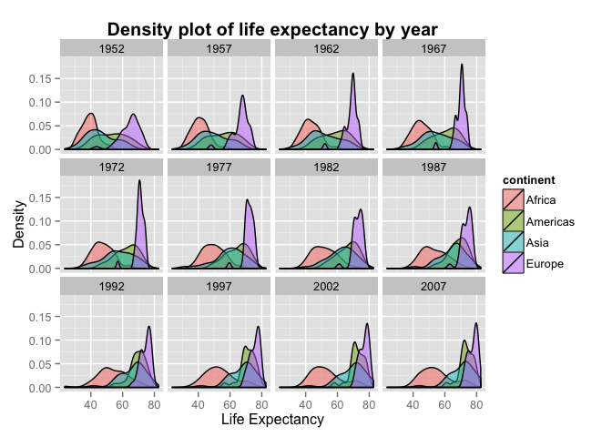
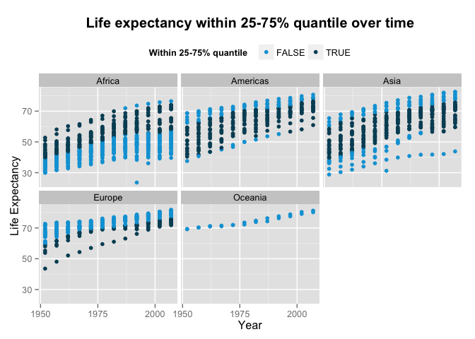
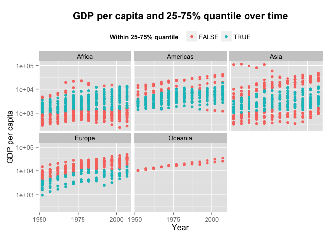

# 2-exploratory-analysis
Michelle Lee  


```r
library(plyr)
library(dplyr)
```

```
## 
## Attaching package: 'dplyr'
## 
## The following objects are masked from 'package:plyr':
## 
##     arrange, count, desc, failwith, id, mutate, rename, summarise,
##     summarize
## 
## The following object is masked from 'package:stats':
## 
##     filter
## 
## The following objects are masked from 'package:base':
## 
##     intersect, setdiff, setequal, union
```

```r
library(ggplot2)
library(ggthemes)

gdat <- read.delim("gapminder.tsv")

ggplot(gdat, aes(x=lifeExp, fill=continent)) + geom_density(alpha=0.5) + facet_wrap(~year) +  ggtitle("Density plot of life expectancy by year") + theme(legend.position="right", plot.title = element_text(size = 15, face="bold")) + xlab("Life Expectancy") + ylab("Density")
```

 

```r
# save graph to file

ggsave(file = "plots/lifeExp-density.png")
```

```
## Saving 7 x 5 in image
```

```r
quantile<-gdat %>%
  group_by(year) %>%
  summarise(q3 = quantile(lifeExp, 0.75), q1 = quantile(lifeExp, 0.25))

ggplot(gdat, aes(x = year, y = lifeExp, colour = lifeExp < quantile$q3 & lifeExp > quantile$q1)) + geom_point(aes(group=year)) + facet_wrap(~ continent) + ggtitle("Life expectancy within 25-75% quantile over time") + theme(legend.position="top", plot.title = element_text(size = 15, face="bold")) + xlab("Year") + ylab("Life Expectancy") + scale_x_continuous(breaks=seq(from=1950, to=2007, by=25)) + scale_y_continuous(breaks=seq(30,80,by=20)) + scale_color_economist(name = "Within 25-75% quantile")
```

 

```r
# save graph to file

ggsave(file = "plots/lifeExp-quantile.png")
```

```
## Saving 7 x 5 in image
```

```r
quantile.gdp<-gdat %>%
  group_by(year) %>%
  summarise(q3 = quantile(gdpPercap, 0.75), q1 = quantile(gdpPercap, 0.25))

ggplot(gdat, aes(x = year, y = gdpPercap, colour = gdpPercap < quantile.gdp$q3 & gdpPercap > quantile.gdp$q1)) + geom_point(aes(group=year)) + facet_wrap(~ continent) + ggtitle("GDP per capita and 25-75% quantile over time") + theme(legend.position="top", plot.title = element_text(size = 15, face="bold")) + xlab("Year") + ylab("GDP per capita") + scale_x_continuous(breaks=seq(from=1950, to=2007, by=25)) + scale_y_log10() + scale_color_discrete(name = "Within 25-75% quantile")
```

 

```r
# save graph to file

ggsave(file = "plots/gdp-quantile.png")
```

```
## Saving 7 x 5 in image
```

```r
# Check factor levels

levels(gdat$continent)
```

```
## [1] "Africa"   "Americas" "Asia"     "Europe"   "Oceania"
```

```r
# Change the factor levels by life expectancy

gdat <- gdat %>%
  mutate(continent = reorder(continent, lifeExp, max)) %>%
  arrange(continent)

# Now the factor levels and order of data should be changed

levels(gdat$continent) 
```

```
## [1] "Africa"   "Americas" "Oceania"  "Europe"   "Asia"
```

```r
head(gdat)
```

```
##   country year      pop continent lifeExp gdpPercap
## 1 Algeria 1952  9279525    Africa  43.077  2449.008
## 2 Algeria 1957 10270856    Africa  45.685  3013.976
## 3 Algeria 1962 11000948    Africa  48.303  2550.817
## 4 Algeria 1967 12760499    Africa  51.407  3246.992
## 5 Algeria 1972 14760787    Africa  54.518  4182.664
## 6 Algeria 1977 17152804    Africa  58.014  4910.417
```

```r
# save the data into another file

dput(gdat, "sorted_gapminder.tsv")
```


