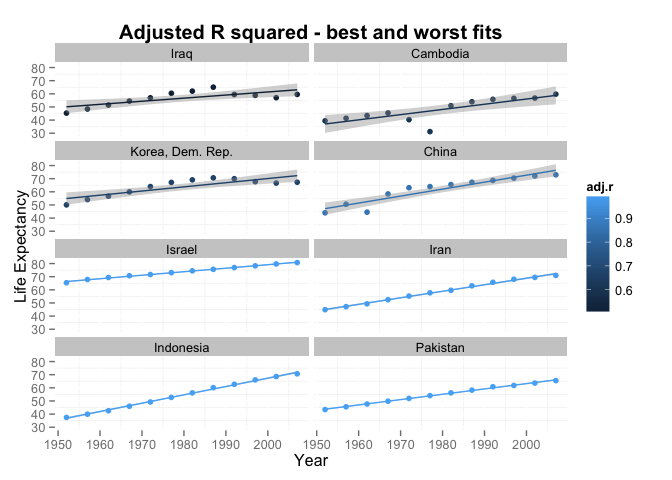
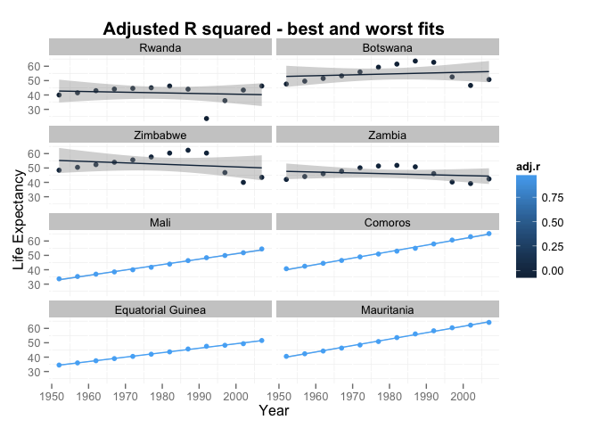
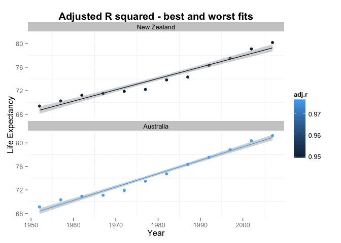
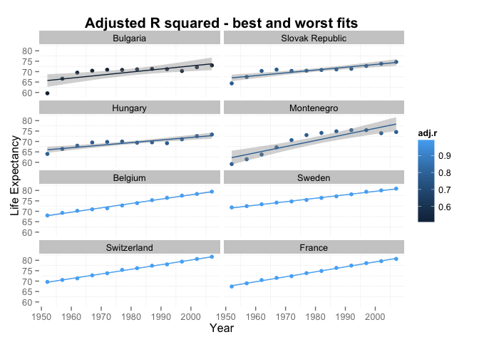
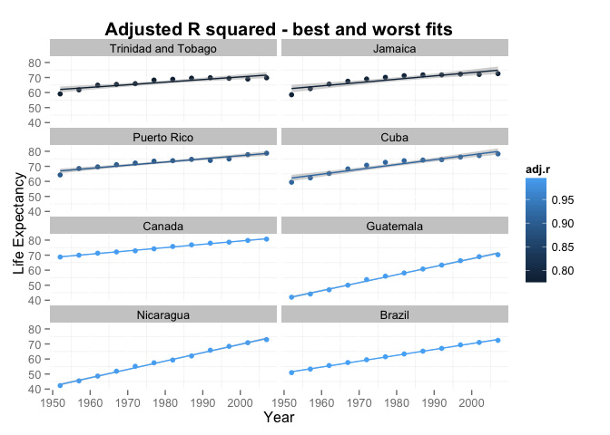

# 4-generate-figures
Michelle Lee  


```r
library(ggplot2)
```

```
## Loading required package: methods
```

```r
library(ggthemes)
library(plyr)
library(dplyr)
```

```
## 
## Attaching package: 'dplyr'
## 
## The following objects are masked from 'package:plyr':
## 
##     arrange, count, desc, failwith, id, mutate, rename, summarise,
##     summarize
## 
## The following object is masked from 'package:stats':
## 
##     filter
## 
## The following objects are masked from 'package:base':
## 
##     intersect, setdiff, setequal, union
```

```r
library(knitr)
# import data from previous R script!

gdat <- dget("sorted_gapminder.tsv")
bw <- dget("best-worst-gapminder.tsv")

dat<- inner_join(gdat, bw, by=c("country", "continent"))

dat <- dat %>%
  mutate(country = reorder(country, adj.r)) %>%
  arrange(country)

ggplot(dat  %>% filter(continent=="Asia"), aes(x = year, y = lifeExp, color = adj.r)) + facet_wrap(~ country, nrow=4) + geom_point() + geom_smooth(method = "lm", se = T) + ggtitle("Adjusted R squared - best and worst fits") + theme(legend.position="right", plot.title = element_text(size = 15, face="bold"), panel.background = element_rect(fill='white')) + xlab("Year") + ylab("Life Expectancy")
```

 

```r
ggsave("r-sq-asia.png");
```

```
## Saving 7 x 5 in image
```

```r
ggplot(dat  %>% filter(continent=="Africa"), aes(x = year, y = lifeExp, color = adj.r)) + facet_wrap(~ country, nrow=4) + geom_point() + geom_smooth(method = "lm", se = T) + ggtitle("Adjusted R squared - best and worst fits") + theme(legend.position="right", plot.title = element_text(size = 15, face="bold"), panel.background = element_rect(fill='white')) + xlab("Year") + ylab("Life Expectancy")
```

 

```r
ggsave("r-sq-africa.png");
```

```
## Saving 7 x 5 in image
```

```r
ggplot(dat  %>% filter(continent=="Oceania"), aes(x = year, y = lifeExp, color = adj.r)) + facet_wrap(~ country, nrow=4) + geom_point() + geom_smooth(method = "lm", se = T) + ggtitle("Adjusted R squared - best and worst fits") + theme(legend.position="right", plot.title = element_text(size = 15, face="bold"), panel.background = element_rect(fill='white')) + xlab("Year") + ylab("Life Expectancy")
```

 

```r
ggsave("r-sq-oceania.png");
```

```
## Saving 7 x 5 in image
```

```r
ggplot(dat  %>% filter(continent=="Europe"), aes(x = year, y = lifeExp, color = adj.r)) + facet_wrap(~ country, nrow=4) + geom_point() + geom_smooth(method = "lm", se = T) + ggtitle("Adjusted R squared - best and worst fits") + theme(legend.position="right", plot.title = element_text(size = 15, face="bold"), panel.background = element_rect(fill='white')) + xlab("Year") + ylab("Life Expectancy")
```

 

```r
ggsave("r-sq-europe.png");
```

```
## Saving 7 x 5 in image
```

```r
ggplot(dat  %>% filter(continent=="Americas"), aes(x = year, y = lifeExp, color = adj.r)) + facet_wrap(~ country, nrow=4) + geom_point() + geom_smooth(method = "lm", se = T) + ggtitle("Adjusted R squared - best and worst fits") + theme(legend.position="right", plot.title = element_text(size = 15, face="bold"), panel.background = element_rect(fill='white')) + xlab("Year") + ylab("Life Expectancy")
```

 

```r
ggsave("r-sq-americas.png");
```

```
## Saving 7 x 5 in image
```

