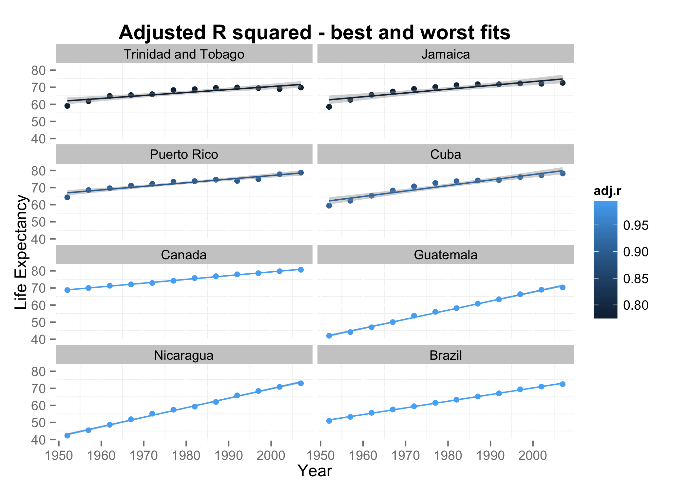

## Homework 9

This is the result of my Makefile pipeline - my plots:

## Reflections

* I learned my lesson to never use `setwd()` when it isn't appropriate - I ended up having to redo and correct so many files because I hadn't taken local dependencies into account. Lesson learned!
* Make is extremely useful when you're trying to analyze and get through a number of files at once. It will definitely be used in the future. 
