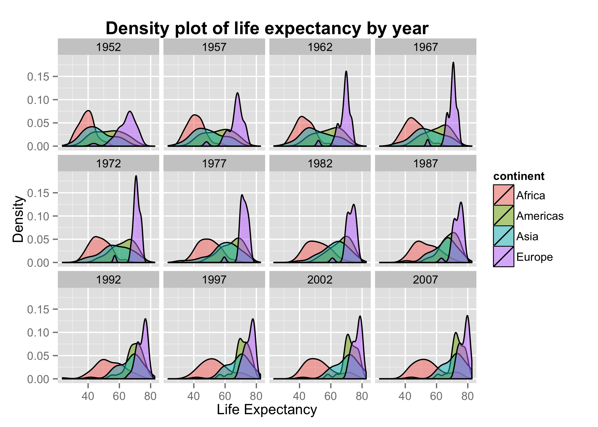
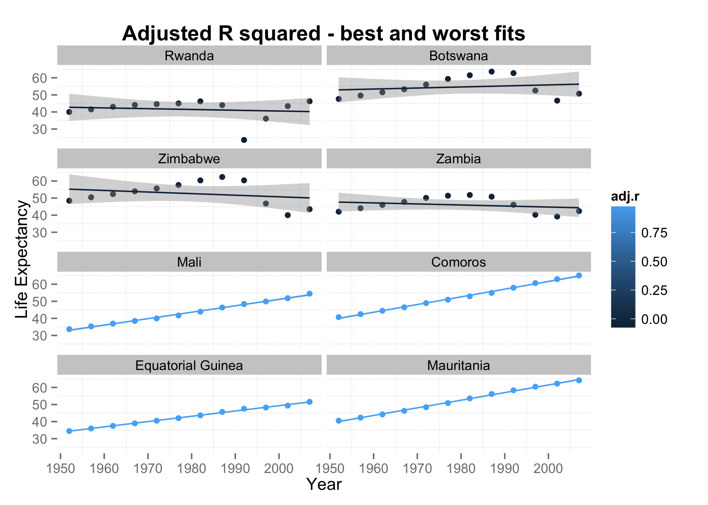

# README
Michelle Lee  
November 24, 2014  

Homework 9: Pipeline
==

The final report produced by the end of the pipeline is [here](https://github.com/STAT545-UBC/zz_michelle_lee-coursework/blob/master/HW9/HW9.md). Some plots I made are below:

# Summary of files
* [1. Downloading data](https://github.com/STAT545-UBC/zz_michelle_lee-coursework/blob/master/HW9/1-download-data.md)
* [2. Exploratory analysis](https://github.com/STAT545-UBC/zz_michelle_lee-coursework/blob/master/HW9/2-exploratory-analysis.md)
* [3. Statisical analysis](https://github.com/STAT545-UBC/zz_michelle_lee-coursework/blob/master/HW9/3-stat-analysis.md)
* [4. Generating figures](https://github.com/STAT545-UBC/zz_michelle_lee-coursework/blob/master/HW9/4-generate-figures.md)
