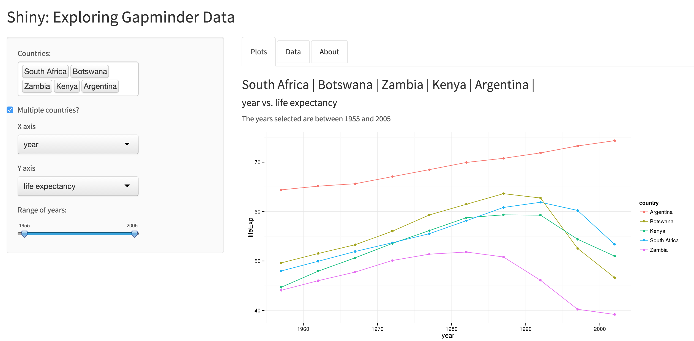

HW11: Shiny
==========================

## Accessing the app

The app has been deployed to shinyapps.io. The link is **[here!](https://mmlee.shinyapps.io/gapminder)**

## Some features I added to the assignment

* Drop down menu for X and Y axis in choosing variables
* Tabs to separate graphs, tables, and an about page
* Using [bootstrap.css](https://github.com/STAT545-UBC/zz_michelle_lee-coursework/blob/master/HW11/gapminder/www/bootstrap.css) for nicer-looking format
* Plotting data points for multiple countries, through different colour schemes 
* Informative (reactive) title to describe the graph
